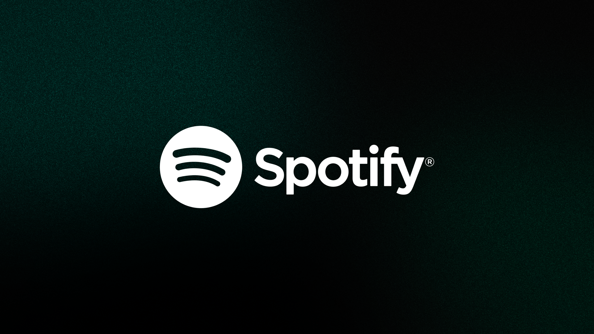

<h1 align="center"> Spotify Clone </h1>

Este projeto trata-se do clone de uma landing page responsiva do site oficial Spotify, esse projeto está sendo desenvolvido durante o programa de imersão ao desenvolvimento front-end feito pela Alura durante 5 aulas.

  <a href="#-tecnologias">Tecnologias</a>&nbsp;&nbsp;&nbsp;|&nbsp;&nbsp;&nbsp;
  <a href="#-projeto">Projeto</a>&nbsp;&nbsp;&nbsp;|&nbsp;&nbsp;&nbsp;
  <a href="#-visualizar-projeto">Layout</a>&nbsp;&nbsp;&nbsp;|&nbsp;&nbsp;&nbsp;
  <a href="#memo-licença">Licença</a>

  

 

  

## 🚀 Tecnologias

Este projeto está sendo desenvolvido com as seguintes tecnologias:

- HTML e CSS
- JavaScript
- Git e Github
- Figma

## 💻 Projeto

Essa Landing page está sendo desenvolvidade durante um imersão online e gratuita da [Alura](https://cursos.alura.com.br/imersao) com o intuito pessoal de ampliar meus conhecimentos com tecnologias web de front-end e aprender alguns truques novos.

## 🔖 Visualizar projeto

Você pode visualizar o site bonitão com mais detalhes através [DESTE LINK](#). 
## :memo: Licença

Esse projeto está sob a licença MIT.

---

Feito com ♥ durante a [Imersão Front-End 2024](https://cursos.alura.com.br/imersao)
